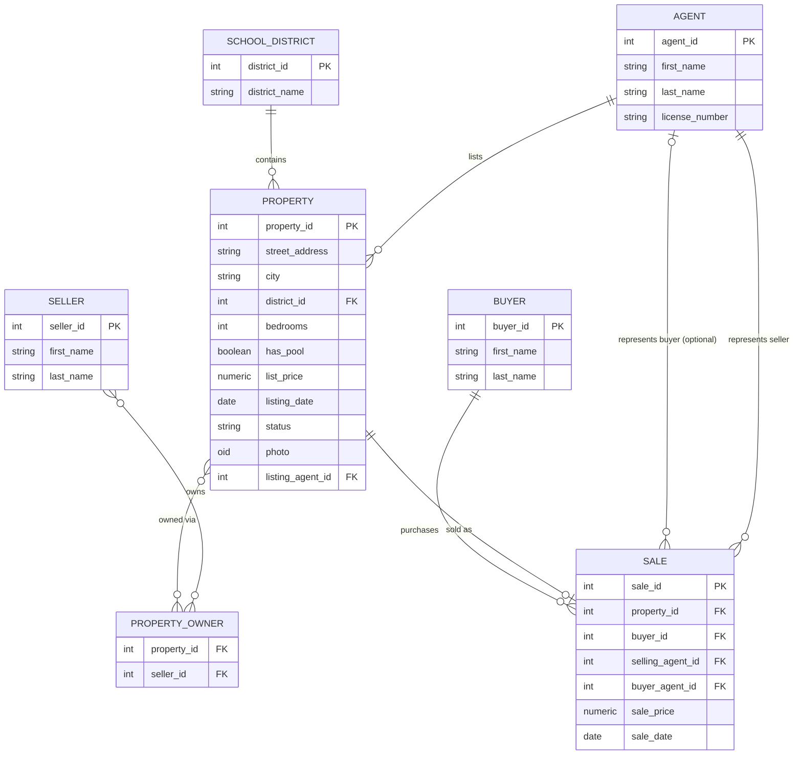

# 🏡 Real-Estate Office Database


A PostgreSQL database design for a small residential real-estate office —
agents, buyers, sellers, active listings, and sales history — built as a
conceptual → logical → physical database design exercise.

## Contents

| Path | What it is |
|---|---|
| [`docs/01_ER_Model.md`](docs/01_ER_Model.md) | Conceptual design: entities, attributes, relationship cardinalities, Mermaid ER diagram |
| [`sql/02_schema.sql`](sql/02_schema.sql) | Logical/physical design: `CREATE TABLE`, constraints, indices, triggers |
| [`sql/03_data.sql`](sql/03_data.sql) | Synthetic sample data (25 properties, 6 agents, 12 buyers, 12 sellers, 9 sales) |
| [`sql/04_load_images.sql`](sql/04_load_images.sql) | Loads house photos as PostgreSQL large objects (BLOBs) via `\lo_import` |
| [`sql/05_queries.sql`](sql/05_queries.sql) | The assignment's required queries (a–g) plus extra queries |
| [`images/`](images) | Sample house photos used for the BLOB demo |

## Entity-Relationship Diagram



Full attribute list and cardinality notes are in [`docs/01_ER_Model.md`](docs/01_ER_Model.md).
GitHub renders the diagram above automatically — no extra tooling needed.

## Quick start

### Option 1 — Docker (fastest)

```bash
docker run --name re-db -e POSTGRES_PASSWORD=postgres -e POSTGRES_DB=realestate -p 5432:5432 -d postgres:16
psql -h localhost -U postgres -d realestate -f sql/02_schema.sql
psql -h localhost -U postgres -d realestate -f sql/03_data.sql
psql -h localhost -U postgres -d realestate -f sql/04_load_images.sql   # optional: loads BLOBs
psql -h localhost -U postgres -d realestate -f sql/05_queries.sql
```

### Option 2 — Existing local PostgreSQL

```bash
createdb realestate
psql -d realestate -f sql/02_schema.sql
psql -d realestate -f sql/03_data.sql
psql -d realestate -f sql/04_load_images.sql
psql -d realestate -f sql/05_queries.sql
```

## Sample query: agent leaderboard for 2004

```sql
SELECT a.first_name, a.last_name, SUM(s.sale_price) AS total_sales_2004
FROM sale s JOIN agent a ON s.selling_agent_id = a.agent_id
WHERE EXTRACT(YEAR FROM s.sale_date) = 2004
GROUP BY a.agent_id, a.first_name, a.last_name
ORDER BY total_sales_2004 DESC;
```

| first_name | last_name | total_sales_2004 |
|---|---|---|
| David | Okafor | 1,118,000.00 |
| Angela | Reyes | 445,000.00 |
| Sofia | Marchetti | 275,000.00 |
| Thomas | Nguyen | 260,000.00 |
| Maria | Chen | 185,000.00 |
| Brian | Kessler | 172,000.00 |

See [`sql/05_queries.sql`](sql/05_queries.sql) for all required and bonus queries.

## Design highlights

- **`school_district`** is normalized out as a lookup table instead of a
  free-text column, so district names stay consistent and are indexable.
- **`property_owner`** is a many-to-many bridge table so a home can have
  joint sellers (e.g. spouses) without denormalizing `property`.
- **`sale`** is a distinct entity (not just extra columns on `property`)
  because a transaction has its own attributes and links to *two* different
  agent roles — the listing/selling agent and the (optional) buyer's agent.
- A **trigger** (`trg_record_sale`) enforces that a property can only be
  sold while it's on the market, rejects sale dates before the listing
  date, and automatically flips `property.status` to `SOLD` — so query (f)
  is a single clean `INSERT`.
- **Images** are stored as PostgreSQL large objects (`OID` column +
  `lo_import`/`lo_export`), populated for only 2–3 listings including the
  most expensive property, per the assignment's scope-control guidance.

## License

MIT — see [`LICENSE`](LICENSE). All data is synthetic; no real listings,
agents, or clients are represented.
